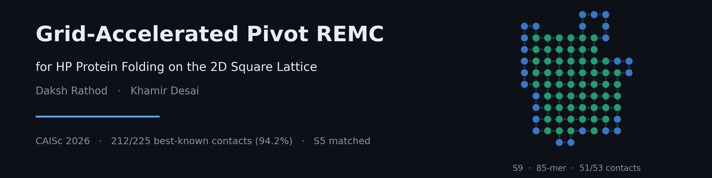
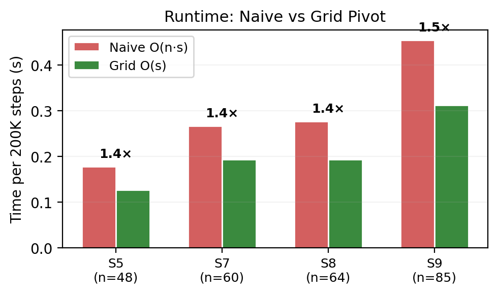
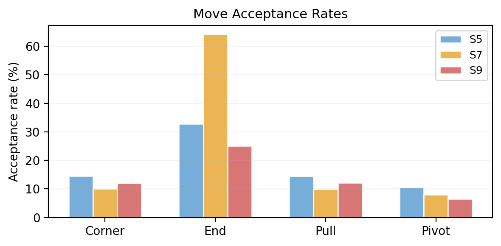
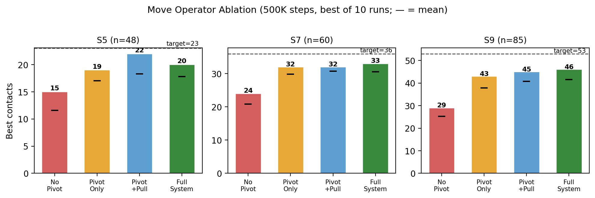
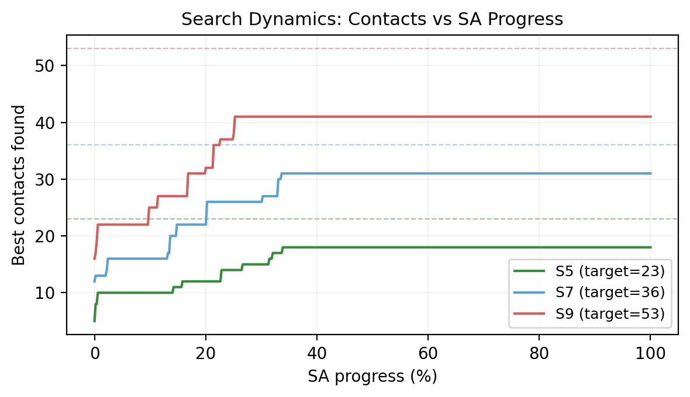
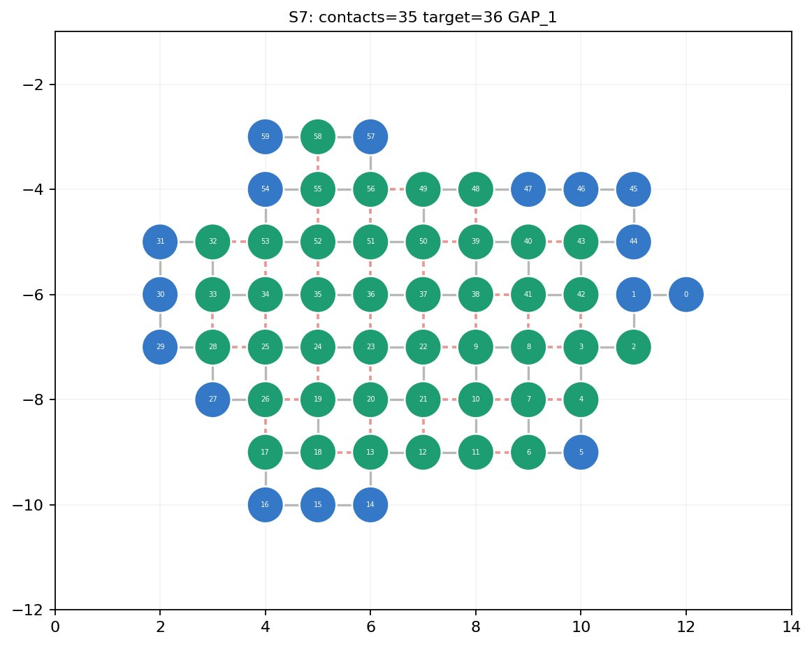
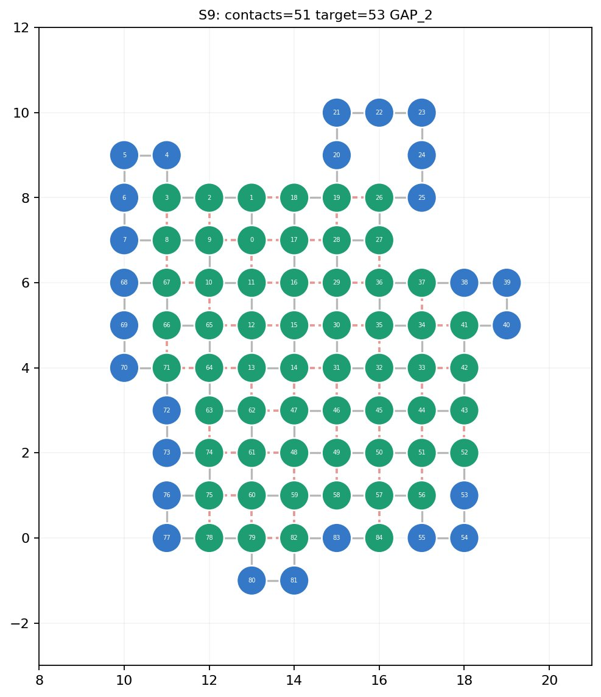
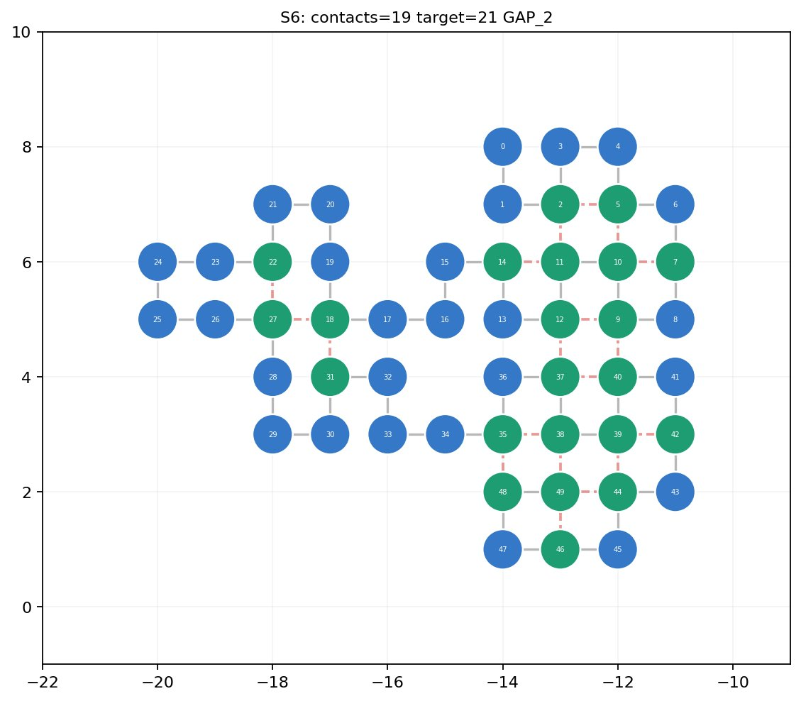
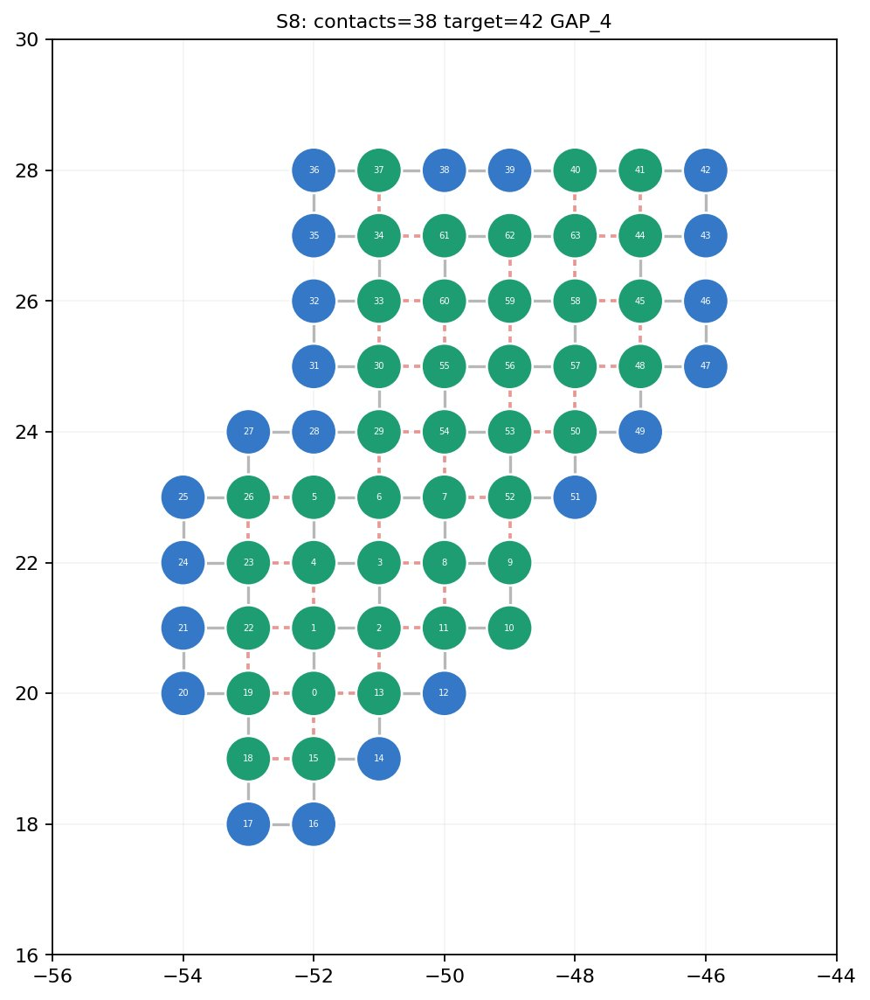

<p align="center">
  
</p>

<p align="center">
  <a href="https://github.com/OWNER/REPO/actions/workflows/ci.yml"></a>
  <a href="https://openreview.net/forum?id=yfMz2KaNJp"></a>
  <a href="https://caisc2026.github.io/accepted_papers.html"></a>
  
  <a href="LICENSE"></a>
  
</p>

# Grid-Accelerated Pivot REMC for HP Protein Folding on the 2D Square Lattice

**[Daksh Rathod](mailto:daksh.hiteshkumar.rathod@gmail.com)**¹ · **[Khamir Desai](mailto:khamir.desai.s@gmail.com)**²
<sub>¹ Dhirubhai Ambani University, Gandhinagar, Gujarat, India &nbsp;·&nbsp; ² Sarvajanik College of Engineering & Technology, Surat, Gujarat, India</sub>

📄 [OpenReview](https://openreview.net/forum?id=yfMz2KaNJp) ·
[PDF](https://openreview.net/pdf?id=yfMz2KaNJp) ·
[local copy](caisc2026_paper.pdf) &nbsp;|&nbsp;
🏆 [CAISc 2026 benchmark](https://caisc2026.github.io/verifiable-problems/?problem=hp-protein-folding)

---

A replica-exchange Monte Carlo solver for the 2D HP protein folding problem, combining
six move operators with grid-based pivot collision detection. On the CAISc 2026 benchmark
suite (S5–S10, lengths 48–100) it matches the best-known 23 contacts on S5 and reaches
**212 of 225 best-known contacts (94.2%)** in a single 10-hour run on one node.

The paper's contribution is not the solver but two controlled experiments about *why* it
works:

1. **A move-operator ablation.** Pivot rotations alone account for roughly **80%** of the
   total improvement over local-move-only search.
2. **A parallelism-versus-coupling test.** A CUDA port running **16,384 concurrent
   independent annealing chains** — about 10³× the CPU configuration, with an identical
   move set — *loses* to CPU REMC on both hard instances. Raw parallelism does not
   substitute for replica exchange.

Together they argue that quality rests on **move design and inter-chain coupling, not
throughput**.

---

## Contents

- [The problem](#the-problem) · [Results](#results) · [Method](#method)
- [Ablation: which moves matter](#ablation-which-moves-matter)
- [Does massive parallelism substitute for replica exchange?](#does-massive-parallelism-substitute-for-replica-exchange)
- [Best conformations](#best-conformations)
- [Two dead move operators](#two-dead-move-operators) — a defect found while building this repo
- [Install](#install) · [Reproduce](#reproduce) · [Train](#train) · [Inference](#inference)
- [Repository layout](#repository-layout) · [Provenance](#provenance) · [Citation](#citation)

---

## The problem

Given a chain of hydrophobic (**H**) and polar (**P**) residues, find a self-avoiding walk
on ℤ² that maximises the number of non-sequential H–H lattice contacts. The problem is
NP-complete on the 2D square lattice, and the search space grows as roughly μⁿ with
μ ≈ 2.638 — about 10⁴² conformations for a 100-residue chain. For chains longer than 36
residues only heuristic best-known values exist.

Energy is `E = −(contacts)`, so lower is better and the ground state is the
maximum-contact fold.

---

## Results

Every number below is recomputed from the committed coordinate files by
[`analyze.py`](analyze.py), never copied from the solver's own output. CI re-derives the
whole table on every push and fails if a single contact count drifts.

| ID | Length | H% | Best known | Ours | Gap | Rg² | Recorded time |
|---|---|---|---|---|---|---|---|
| S5 | 48 | 52.1% | 23 | **23** | **matched** | 8.1 | 48 min |
| S6 | 50 | 44.0% | 21 | **19** | 2 | 10.4 | 48 min |
| S7 | 60 | 71.7% | 36 | **35** | 1 | 10.5 | 67 min |
| S8 | 64 | 65.6% | 42 | **38** | 4 | 13.1 | 79 min |
| S9 | 85 | 69.4% | 53 | **51** | 2 | 14.8 | 171 min |
| S10 | 100 | 56.0% | 50 | **46** | 4 | 18.7 | 11 min |
| **Total** | | | **225** | **212** | **94.2%** | | |

S1–S4 (lengths 20–36) have optima confirmed by exhaustive search and are used only to
validate the scorer; the solver reaches all four.

> **On the time column.** This is the `elapsed_seconds` field recorded in each checkpoint.
> For S5–S9, which ran to their deadlines, it is the full time allocated to that sequence.
> For S10 it is the time at which its best fold was *found*. The paper attributes S10's
> 11 minutes to a scheduling error that ended its loop early; the committed training log
> shows S10 still searching at round 18 with 93 minutes left of a 184-minute allocation,
> so the 11-minute figure is time-to-best rather than total compute. Either way S10 is the
> under-resourced instance. See [Provenance](#provenance).

Reproduce the table from the committed coordinates:

```bash
python analyze.py --check
```

---

## Method

The solver alternates parallel simulated annealing and replica-exchange Monte Carlo rounds
inside a wall-clock budget loop, reseeding each round from the best conformation found so
far. Six operators, all preserving the self-avoiding-walk constraint, are accepted or
rejected by the Metropolis criterion `P = min(1, e^(−ΔE/T))`.

| Operator | Budget | What it does | Cost |
|---|---|---|---|
| Corner flip | 12% | Reflects an L-shaped residue across the diagonal | O(n), incremental ΔE |
| End flip | 8% | Swings a terminal residue to a free neighbour of its anchor | O(n), incremental ΔE |
| Simple pull | 8% | Moves an interior residue to a site adjacent to both neighbours | O(n), incremental ΔE |
| Crankshaft | 15% | Swaps a bonded pair to complementary diagonal corners | O(n²) — [never fires](#two-dead-move-operators) |
| **Pivot rotation** | **35%** | Rotates an entire segment 90/180/270° about a pivot residue | O(s) collision + O(n²) ΔE |
| Bond rebridging | 22% | Reverses an internal segment between spliceable bonds | O(n²) — [never fires](#two-dead-move-operators) |

Annealing cools geometrically from `T = 5.5` to `T = 0.002` over up to 4×10⁶ steps. REMC
uses a geometric ladder across 12–40 replicas with even/odd alternating neighbour swaps at
`P = min(1, exp[(βᵢ−βⱼ)(Eⱼ−Eᵢ)])`; the coldest replica is seeded with the global best.
Energy is tracked incrementally but recomputed from scratch every `N/40` steps, because
accumulated ΔE drifts.

### Grid-accelerated pivots

A naive pivot checks each rotated position against every non-rotated residue, at `O(n · s)`
for a segment of length `s`. Since the solver already maintains an occupancy grid
`G ∈ {0,1}^((2n+5)²)`, the check becomes a constant-time lookup per residue:

```
lift the old segment out of the grid       O(s)
for each rotated position:
    if grid[position] occupied -> undo all placements, reject
    else mark occupied                     O(1) each
ΔE <- E_full(after) - E_full(before)       O(n²)
```

A rotation is a rigid isometry, so it preserves all pairwise distances: a self-avoiding
segment stays self-avoiding, and only collisions against the rest of the chain need
checking. That drops collision detection from `O(n · s)` to `O(s)`.

The measured end-to-end gain is only **1.4–1.5×**, because the `O(n²)` energy recompute —
shared by both versions — dominates total pivot cost.

<p align="center">
  
  
</p>
<p align="center"><sub><b>Figure 2</b> (left): grid-based collision yields 1.4–1.5× total speedup; the modest gain reflects O(n²) energy-recompute dominance. &nbsp;·&nbsp; <b>Figure 3</b> (right): pivots have the lowest acceptance rate (6–10%) but the highest per-accept structural impact.</sub></p>

Pivots have the *lowest* acceptance rate — most rotated segments collide — yet accepted
pivots produce the largest structural changes. End flips have the highest acceptance
(25–64%) and contribute least.

---

## Ablation: which moves matter

Four solver variants, each run for 500K SA steps with 10 independent seeds:

<p align="center">
  
</p>
<p align="center"><sub><b>Figure 1.</b> Move ablation (500K steps, best of 10 runs; black markers indicate mean). Dashed lines show best-known targets.</sub></p>

| Variant | S5 best (mean) | S7 best (mean) | S9 best (mean) |
|---|---|---|---|
| No Pivot | 15 (11.6) | 24 (20.8) | 29 (25.3) |
| Pivot Only | 19 (17.0) | 32 (29.8) | 43 (37.9) |
| Pivot + Pull | 22 (18.3) | 32 (30.7) | 45 (40.7) |
| Full System | 20 (17.8) | 33 (30.6) | 46 (41.6) |

On S9 (n = 85), removing pivots drops mean contacts from **41.6 to 25.3**, a 39% decrease.
Adding pivots alone recovers 12.6 of the 16.3 total improvement — **77%**. Local moves
contribute the remaining 3.7 by fine-tuning residue positions within the topology that
pivots discovered. 

The ablation deliberately uses a restricted single-CPU setting — one SA chain, 500K steps,
10 seeds — to isolate operator contributions under identical conditions. Its absolute
counts are therefore below the full pipeline's (20 vs 23 for S5), which uses hundreds of
parallel chains and orders of magnitude more steps. The transferable finding is the
*relative* dominance of pivots, consistent across all three lengths.

Note that "Pivot + Pull" *beats* "Full System" on S5 (22 vs 20). The paper reads this as
shorter chains favouring simpler move sets. The [dead-operator finding](#two-dead-move-operators)
below suggests a more direct explanation.

### Search dynamics

<p align="center">
  
</p>
<p align="center"><sub><b>Figure 4.</b> Roughly 80% of the final contacts are found within the first 30% of steps; the rest provide diminishing refinement.</sub></p>

Under a fixed compute budget, many short runs likely beat few long ones — which is why
`train.py` launches up to 256 parallel chains per round rather than one long chain.

---

## Does massive parallelism substitute for replica exchange?

If pivots do most of the work, can raw parallelism replace replica exchange? The paper
answers **no**, with a controlled test.

The complete move set — pivot, corner, pull, end, with the same incremental-ΔE pivot — was
ported to a CUDA kernel in which each thread anneals one independent chain to convergence
using a per-thread occupancy grid. On 2× Tesla T4 this runs **16,384 concurrent chains per
launch**, two to three orders of magnitude more than the CPU configuration. Threads never
communicate, so there is no replica exchange.

| Instance | Best known | GPU: parallel SA | Gap | CPU: REMC | Gap |
|---|---|---|---|---|---|
| S8 (n=64) | 42 | 37 | 5 | **38** | **4** |
| S10 (n=100) | 50 | 45 | 5 | **46** | **4** |

Despite ~10³× more concurrent chains, the GPU configuration was **worse on both instances,
losing one contact each**. Both GPU folds are valid self-avoiding walks with
verifier-confirmed contact counts.

The interpretation is constructive. Independent chains, however many, each explore a single
basin and cannot share progress: a chain that falls into a poor core topology early wastes
its entire budget. Replica exchange couples chains through a temperature ladder, letting a
good conformation found at high temperature propagate down for low-temperature refinement.
The ablation shows *which moves* matter; this experiment shows the *coupling between
chains* contributes something extra chains do not replace.

> **Design guidance: prefer fewer coupled replicas over many independent ones.**

This also tempers the speedup result — faster pivots help, but throughput is not the
binding constraint on quality. Two caveats the paper states: warp divergence from
variable-length pivot segments puts realised GPU throughput below peak, and this compares
two design points rather than parallel SA and REMC in general.

> **Not in this repository.** The CUDA kernel is described in the paper (Section 4.8) but
> was not part of the artifact this repository was built from. Table 3 above is transcribed
> from the paper; unlike every other table here, it is *not* recomputed from committed
> coordinates, because those coordinates are not in this repo. Everything else in
> `results/` and `checkpoints/` is the CPU REMC run.

---

## Best conformations

Green = hydrophobic (H), blue = polar (P), dashed red = H–H contacts. The compact
diamond-shaped hydrophobic cores in S7 and S9 are the signature of near-optimal folds: H
residues pack tightly in the interior while P segments form the exterior boundary.

<p align="center">
  
  
</p>
<p align="center"><sub><b>Figure 5.</b> S7 (35 contacts, gap 1) and S9 (51 contacts, gap 2).</sub></p>

<p align="center">
  
  
</p>
<p align="center"><sub><b>Figure 6.</b> S6 (19 contacts, gap 2) and S8 (38 contacts, gap 4). S8's 66% H-density creates a rugged landscape with many competing near-optimal core arrangements.</sub></p>

- **S5 (48-mer, matched).** Reaches 23 contacts consistently. Balanced H-density gives a
  landscape where pivots efficiently locate the optimal core topology.
- **S7 (60-mer, gap 1).** A dense core spanning the full lattice extent. The last contact
  likely needs a global rearrangement not found within 67 minutes.
- **S9 (85-mer, gap 2).** 51 of 53, the largest allocation. The two missing contacts are
  attributable to the P-rich tail (residues 64–85) not being optimally threaded through the
  core boundary.
- **S8 (64-mer, gap 4).** Highest H-density, and the hardest landscape in the suite.
- **S10 (100-mer, gap 4).** The largest chain and the most under-resourced — see the note
  under [Results](#results).

Redraw any of these from the committed coordinates:

```bash
python analyze.py --figures
```

---

## Two dead move operators

**This is a defect found while building this repository, not a finding from the paper. It
is reproduced here rather than fixed.**

`crankshaft` and `rebridging` fire **zero times** in 2000 attempts each — from random walks
and compact annealed folds alike. Both preconditions are unsatisfiable on the square
lattice, for the same parity reason:

> A chain bond flips the parity of `x + y`. So for residues *i* and *j*, the Manhattan
> distance `|cᵢ − cⱼ|` always has the same parity as `j − i`.

- **Crankshaft** requires `c[i−1]` and `c[i+2]` to be *diagonally* adjacent. Their chain
  separation is 3 (odd), so their Manhattan distance must be odd — but diagonal adjacency
  means a distance of exactly 2. Unsatisfiable.
- **Rebridging** picks `j` as a *lattice neighbour* of `i`, which forces `|i − j|` odd. It
  then requires `c[j−1]` adjacent to `c[i]`, a separation of `j−1−i` (even), so that
  distance must be even and can never be 1. Unsatisfiable.

Confirmed by exhaustive enumeration over all 189,948 self-avoiding walks up to length 12:
zero hits for either condition. Both proofs are pinned by tests in
[`test_model.py`](test_model.py) that fail if either operator ever fires.

**Consequences.** The paper states that 72% of the move budget goes to large-scale
structural change. In practice only the 35% pivot share does; crankshaft (15%) plus
rebridging (22%) = **37% of every run was spent on no-ops**. This also gives a simpler
reading of the S5 ablation anomaly: "Full System" does not lose to "Pivot + Pull" because a
richer move set explores less efficiently, but because it throws away 37% of its attempts.

It is worth noting what this does *not* undermine. The pivot-dominance result is unaffected
— if anything strengthened, since "Full System" achieves its numbers on an effective 63% of
its budget. The GPU comparison is likewise unaffected: that kernel implements only pivot,
corner, pull and end, none of which are dead.

This is the **same class of defect** as the cascade-pull bug documented in Section 5 of the
paper — a move whose geometric precondition cannot hold, failing silently rather than
loudly. That one was caught before publication; these two were not. Since the published
results came from exactly this code, the operators are left intact so the repository
reproduces them.

**If you fix them,** expect the two pinning tests to fail, and re-run `train.py` before
updating any number in this README. A corrected crankshaft requires `c[i−1]` and `c[i+2]`
to be lattice-*adjacent*, not diagonal.

---

## Install

Requires Python 3.10–3.12. Numba does the heavy lifting; the solver is CPU-only.

```bash
git clone https://github.com/OWNER/REPO.git
cd REPO
python -m venv .venv && source .venv/bin/activate
pip install -r requirements.txt
```

Verify the install against the committed results:

```bash
pytest -q            # 41 tests, ~20 s
python analyze.py    # prints the results table
```

---

## Reproduce

Re-derive every published number from the committed coordinate files — no search, a few
seconds:

```bash
python analyze.py --check              # re-score all six folds, exit non-zero on any error
python analyze.py --markdown           # regenerate the results table above
python analyze.py --figures --banner   # regenerate conformation figures and the banner
```

Check the benchmark sequences against the live competition JSON:

```bash
python datasets.py                                   # print the benchmark
python -c "import datasets; datasets.check_official_problem_data()"
```

---

## Train

`train.py` runs the full search. It splits the budget across sequences by `TIME_WEIGHTS`,
checkpoints every improvement immediately, and refuses to start if the local sequence
snapshot disagrees with the live competition JSON.

```bash
# the published configuration: all six instances, 10 hours
python train.py --hours 10

# a single instance
python train.py --seq S5 --hours 1

# ~1 minute end-to-end check of the whole pipeline
python train.py --smoke --seq S1 --no-strict-official-check
```

| Flag | Default | Meaning |
|---|---|---|
| `--hours` | `9.0` | Total wall-clock budget across all sequences |
| `--seq` | `S5 … S10` | Which instances to solve |
| `--workers` | `min(cpu_count, 16)` | Parallel SA/REMC processes |
| `--no-resume` | off | Ignore existing checkpoints and start cold |
| `--no-strict-official-check` | off | Warn instead of aborting if the live JSON differs |
| `--smoke` | off | Tiny run for CI and sanity checks |

Checkpoints land in `checkpoints/best_<id>.json` and submissions in
`results/<id>_submission.json`. **Running `train.py` from a clean checkout will overwrite
the committed results** — work on a copy if you want to keep them.

> Reproducing the published numbers needs the published budget: 10 hours on a 16-worker CPU
> node. A short run will not match the table.

---

## Inference

```bash
# fold a benchmark instance for 60 seconds
python predict.py --seq S5 --seconds 60

# fold an arbitrary H/P chain
python predict.py --sequence HPHPPHHPHPPHPHHPPHPH --seconds 20 --out fold.json

# re-score a stored fold without searching
python predict.py --score results/S9_submission.json
```

Scoring reads coordinates back with the pure-Python scorer in `model.py`, independently of
the compiled kernels that produced them — a fold that only looks good because of a bug in
the JIT path will not pass.

```json
{
  "file": "results/S9_submission.json",
  "sequence_id": "S9",
  "length": 85,
  "valid": true,
  "contacts": 51,
  "radius_gyration2": 14.8152,
  "target_contacts": 53,
  "gap": 2
}
```

Use the library directly:

```python
from datasets import SEQUENCES
from predict import fold, score

result = fold(SEQUENCES["S5"]["sequence"], seconds=30)
print(result["contacts"], result["coords"][:3])

print(score("results/S7_submission.json"))
```

---

## Repository layout

```
model.py           HP lattice model: energy, six move operators, SA and REMC kernels
datasets.py        Benchmark sequences S1-S10, targets, live-JSON verification
train.py           Search driver: budgeted SA/REMC rounds, checkpointing, submissions
predict.py         Fold a sequence, or re-score a stored fold
analyze.py         Rebuild the results table, figures and banner from coordinates
test_model.py      41 tests: model invariants, dead-operator proofs, result integrity

assets/            The paper's eight figures at source resolution, plus the banner
results/           Submission coordinates (S5-S10) and the verification artifact
checkpoints/       Best fold per sequence, with contacts, Rg² and timing
logs/              Verbatim stdout from the published 10-hour run

caisc2026_paper.pdf           The paper, as accepted at CAISc 2026
foldpaper_a100_final.ipynb    The original notebook the published run was launched from
```

---

## Provenance

Everything in `results/`, `checkpoints/` and `logs/` comes from the single 10-hour run on a
Lightning AI A100-40GB instance (16 CPU workers; the GPU is unused by this solver). Nothing
has been regenerated or retouched, with the exceptions noted here.

- **`logs/train_a100_10h.log`** is the verbatim stdout of the notebook's launch cell,
  reassembled from its two output streams in order. It ends mid-S10 at round 18.
- **`results/S10_submission.json`** is the one file the run never wrote, because it ended
  during S10. It was regenerated from `checkpoints/best_S10.json` through the normal
  `train.write_submission` path, which re-validates the fold before writing. Its 46
  contacts are the run's own result, not a re-search.
- **`results/verification_summary_2026-05-29_superseded.json`** is a **pre-fix artifact,
  kept deliberately**. It predates the sequence-verification fix and contains two chains
  that are *not* the benchmark chains — a 63-residue S7 (the real one is 60) and a
  different S10. It is the evidence for the "sequence hallucination" failure mode in
  Section 5 of the paper. **Do not use it for results**; the authoritative artifact is
  `results/verification.json`.
- **The GPU experiment (Section 4.8)** is not in this repository — see the note in that
  section.
- **H-density** in the results table is computed from the sequences rather than taken from
  the paper's Table 2, which rounds several entries loosely (S7 is 71.7%, printed as 67%;
  S1 is 50.0%, printed as 55%).

The two source materials — the paper PDF and the original notebook — are committed
unmodified. The `.py` modules are that notebook refactored into importable form: the
kernels, move operators, temperature schedules and move probabilities are unchanged, so the
search behaves identically. The notebook's `pip install numba` bootstrap was dropped in
favour of `requirements.txt`.

---

## Documented failure modes

The paper devotes Section 5 to what went wrong during LLM-led development, which is unusual
enough to be worth surfacing. Four modes are documented:

1. **Missing pivots (v1).** The first solver used only corner flips, end flips and simple
   pulls, despite pivots' prominence in the cited literature. Results were poor: S5 gap 6,
   S8 gap 13, S9 gap 14.
2. **The cascade-pull bug (v2).** A move requiring a lattice position adjacent to two
   *bonded* residues simultaneously — geometrically impossible, since two adjacent
   positions have disjoint 4-neighbourhoods. 25% of the move budget was silently wasted on
   dead code for an entire solver version.
3. **Sequence hallucination.** Incorrect sequences for S6 and S10 taken from parametric
   memory rather than the competition source. Runtime verification against the live JSON
   caught it before submission, and is why `datasets.check_official_problem_data` exists.
4. **Scheduling error.** The time-budget loop ended early for S10, the 100-mer with the
   largest search space.

To which this repository adds a fifth of the same family:
[two more dead move operators](#two-dead-move-operators), found by testing whether each
operator ever fires.

---

## Limitations

- Benchmark results come from a **single 10-hour run**; no error bars. The ablation reports
  best and mean over 10 seeds.
- 37% of the move budget is dead code, as described above.
- Pivot ΔE is a full `O(n²)` recompute in the CPU path, which caps the grid speedup at
  ~1.5×. Porting the GPU kernel's incremental ΔE would remove it — though Section 4.8
  suggests throughput is not the binding constraint on quality.
- The remaining gap to Wang–Landau on S9 (51 vs 53) is plausibly attributable to its
  flat-histogram property, which forces exploration of all energy levels — something REMC
  with a fixed geometric ladder does not provide.

---

## Citation

```bibtex
@inproceedings{rathod2026gridaccelerated,
  title     = {Grid-Accelerated Pivot {REMC} for {HP} Protein Folding
               on the {2D} Square Lattice},
  author    = {Rathod, Daksh and Desai, Khamir},
  booktitle = {Proceedings of the 1st Conference for AI Scientists (CAISc)},
  year      = {2026},
  url       = {https://openreview.net/forum?id=yfMz2KaNJp}
}
```

## References

- Lau & Dill (1989). *A lattice statistical mechanics model of the conformational and sequence spaces of proteins.* Macromolecules 22(10):3986–3997.
- Crescenzi, Goldman, Papadimitriou, Piccolboni & Yannakakis (1998). *On the complexity of protein folding.* J. Comput. Biol. 5(3):423–465.
- Berger & Leighton (1998). *Protein folding in the hydrophobic-hydrophilic (HP) model is NP-complete.* J. Comput. Biol. 5(1):27–40.
- Unger & Moult (1993). *Genetic algorithms for protein folding simulations.* J. Mol. Biol. 231(1):75–81.
- Lesh, Mitzenmacher & Whitesides (2003). *A complete and effective move set for simplified protein folding.* RECOMB, 188–195.
- Thachuk, Shmygelska & Hoos (2007). *A replica exchange Monte Carlo algorithm for protein folding in the HP model.* BMC Bioinformatics 8:342.
- Wüst & Landau (2012). *Optimized Wang–Landau sampling of lattice polymers.* J. Chem. Phys. 137:064903.
- Shatabda, Newton, Rashid & Sattar (2013). *An efficient encoding for simplified protein structure prediction using genetic algorithms.* IEEE CEC, 1217–1224.
- Khandoker, Inack & Hibat-Allah (2025). *Lattice protein folding with variational annealing.* Mach. Learn.: Sci. Technol. 6(3):035023.
- Lam, Pitrou & Seibert (2015). *Numba: A LLVM-based Python JIT compiler.* LLVM-HPC @ SC15.
- Mahajan (2026). *HP Protein Folding.* [CAISc 2026 Verifiable Problems Track](https://caisc2026.github.io/verifiable-problems/?problem=hp-protein-folding).

## License

[MIT](LICENSE) © 2026 Daksh Rathod, Khamir Desai.
# Grid-Accelerated-Pivot-REMC
